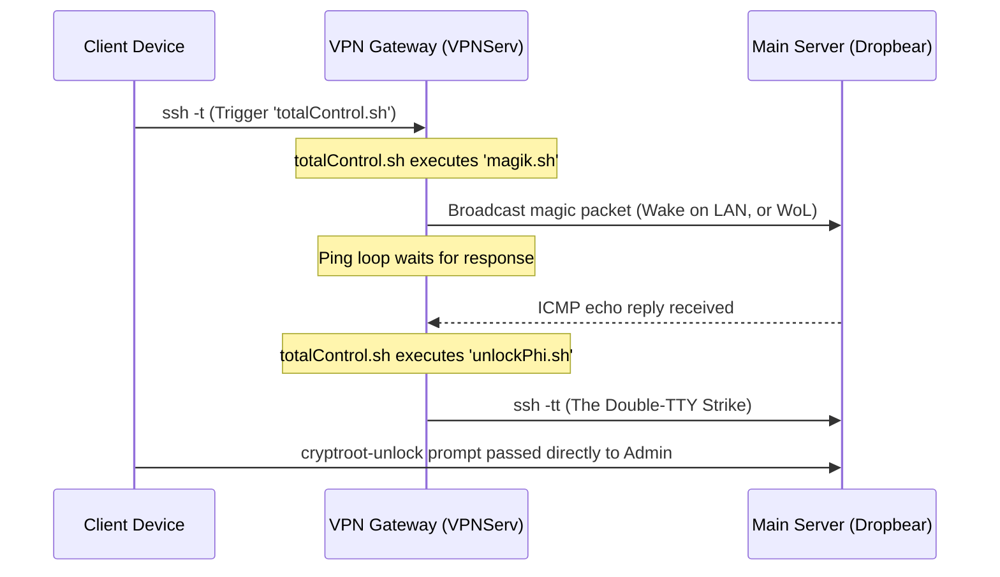

# Remote boot & remote LUKS unlocker

## Overview
This project documents my custom workflow for remotely waking and decrypting my headless, full disk encrypted (LUKS) homelab server. 

Instead of leaving a high powered exgaming PC running 24/7, this setup allows me to keep the server powered down and encrypted at rest. When compute power is needed, I trigger a multi-stage shell environment that wakes the server, waits for the pre-boot environment, and securely tunnels the decryption keys.

This whole process can take as long as one minute before all the services in my server are ready.

## Architecture & The Double-TTY Strike

I broke the process down into modular Bash scripts hosted on a lightweight, always on VPN gateway (`VPNServ`).


---

### 1. `connectGateway.sh`
This is the script you run from your personal laptop or phone to start the whole process.

```bash
#!/bin/bash
# Description: Connects to the VPN gateway and triggers the orchestrator script
# Usage: Run this from your local machine

ssh -t user@VPNServ "/home/user/code/bin/totalControl.sh"
```
### 2. `connectGateway.sh`
This sits on your VPN gateway. It is the orchestrator that fires the magic packet and waits for the server to wake up.

```bash
#!/bin/bash
# totalControl.sh - Orchestrates the wake and unlock sequence

~/bin/code/magik.sh
echo "Waiting for Dropbear to wake up..."

# Wait for the IP to become pingable before attempting SSH
while ! ping -c 1 -n -w 1 192.168.202.X &> /dev/null; do
    printf "."
    sleep 1
done

echo -e "\nSystem is up! Sending unlock command..."
~/code/bin/unlockPhi.sh
```

### 3. `magik.sh`
This also sits on your VPN gateway. It handles the actual WoL broadcast.

```bash
#!/bin/bash
# magik.sh - Broadcasts the WoL packet

# Replace with the actual MAC address of the main server
wakeonlan XX:XX:XX:XX:XX:XX
```

### 4. `unlockPhi.sh`
This is the final script on your VPN gateway. It executes the Double-TTY strike to pass the decryption prompt back to you.

```bash
#!/bin/bash
# unlockPhi.sh - The Double-TTY Strike

REMOTE_IP="192.168.202.X"
KEY_PATH="$HOME/.ssh/VPNServ_key"

# The -tt flag forces the interactive prompt back to the originating screen.
# StrictHostKeyChecking is disabled here because the Dropbear initramfs 
# environment has a different host signature than the fully booted OS.

ssh -tt -i "$KEY_PATH" \
    -o "UserKnownHostsFile=/dev/null" \
    -o "StrictHostKeyChecking=no" \
    root@$REMOTE_IP "cryptroot-unlock"
```

P.S.: For anyone wondering why I divide every task into micro tasks, it is because I was taught to divide my problems into lots of little ones. Also, on Bash, having multiple scripts that do different things is always nicer! Since I may have to use simpler tools sometime.
