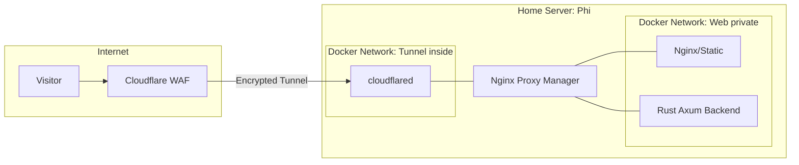

# Hardened Self Hosted Web Infrastructure

## Overview
This project is a study in **network isolation and defensive systems.** Instead of using traditional hosting, I host my personal website on my local hardware (**'Phi'**) using a multi layered Docker environment. 

The goal was to achieve a professional website for **€0**. By using Cloudflare Tunnels and strict Docker networking, I have exposed the site to the public internet without opening a single port on my home router!

## The "gatekeeper" architecture
I utilize a "Need to Know" networking model. Even though services reside on the same physical host, they are isolated at the bridge level to prevent lateral movement.

### Network Flow:
1. **Public Layer**: Traffic hits the `eu.org` domain, proxied through Cloudflare.
2. **Tunnel Layer**: The `cloudflared` container establishes an outbound connection. It sits on **Network A**.
3. **Proxy Layer**: **Nginx Proxy Manager (NPM)** acts as the sole bridge. It is the only container with interfaces on both **Network A** and **Network B**.
4. **Application Layer**: The **Rust/Axum backend** and Nginx static server sit on Network B, with no direct path to the tunnel or the internet.

## Key technical implementation

### 1. Advanced segmentation
To ensure maximum security, I configured the `docker-compose.yml` to define strictly separate networks. 

* **The isolation**: The `cloudflared` container and the website container cannot communicate directly.
* **The bridge**: Traffic must be brokered through the **NPM**, allowing me to inspect and control flow between the two segments.

### 2. Backend (Rust/Axum)
The backend is built with memory safety and security as priorities:

* **Rate limiting**: Integrated `tower-governor` to enforce a **1MB + 1 request/60s/IP** limit on the contact form to prevent automated spam and DOS.
* **Input validation**: All user input is sanitized and validated via the `validator` crate before reaching the database.
* **Security headers**: Explicitly injected `Content-Security-Policy`, `X-Frame-Options`, and `X-Content-Type-Options` to mitigate XSS and Clickjacking.

### 3. Container security
* **Multistage builds**: The `Dockerfile` uses a builder stage to compile the binary; the final runtime image contains **zero source code** and no build tools, drastically reducing the attack surface.
* **Non root execution**: The application runs under a dedicated `appuser`, ensuring that a process breach does not grant root access to the container or host.

### 4. Firewall hardening
I modified my host's **UFW** to ensure:

* **Internal routing only**: Nginx is restricted to internal Docker network traffic.
* **No open ports**: Since I use a Cloudflare Tunnel, I have **0 open ports** on my router. This effectively hides my home IP from potential botnets and scanners.

### 5. SSL and edge security
* **Domain**: Secured a free community TLD via `eu.org`.
* **Encryption**: Implemented full SSL/TLS Let's Encrypt.

---

## Technical Toolkit

| Component | Choice | Purpose |
| :--- | :--- | :--- |
| **Language** | Rust (Axum) | Secure, memory safe, and high performance backend. |
| **Domain** | `eu.org` | Permanent €0 community backed TLD(better than some paid options, also). |
| **Tunnel** | `cloudflared` | Zero entryway tunnel (no port forwarding). |
| **Proxy** | Nginx Proxy Manager | Traffic brokering and SSL (Let's Encrypt) management. |
| **Database** | SQLite | Lightweight, encrypted at rest persistence for messages. |
| **Security** | UFW / Cloudflare | Multi layer perimeter and defense. |

---

> **SOC Analyst Perspective**: This project demonstrates the practical application of **Attack Surface Reduction**. By treating a simple personal site with the same rigor as an enterprise application: using isolation, least privilege, and deterministic builds, I have created a resilient environment.
